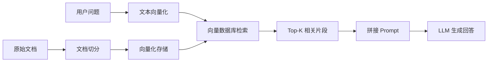

## 一、RAG（检索增强生成）：让 LLM“带着资料回答问题”
### 1.1 RAG 是什么？
**RAG = Retrieval-Augmented Generation（检索增强生成）**，一句话概括：
> 先从你的知识库里“找资料”，再让 LLM 结合这些资料生成回答。
典型流程是：用户提问 → 系统把问题转成向量 → 在向量数据库里检索相似文档块 → 把“问题 + 相关文档”一起丢给 LLM → LLM 基于资料生成答案。
它的价值在于：
- LLM 的“记忆”是有限的（上下文长度有限，还有知识过时问题）。
- RAG 让你能**把企业/私有知识库“外挂”给 LLM**，而不需要重新训练模型。
- 目前企业落地大模型，**RAG 是最主流、最可控的方案**。
---
### 1.2 核心三要素：向量数据库 + Embedding + 文档切分
可以理解成一个“检索–增强–生成”的流水线：

#### 1）文档切分（Chunking）
**为什么不能把整篇文档直接扔给 LLM？**
- 文档太长，超出上下文窗口。
- 检索时太粗粒度，会带进大量无关噪音。
所以需要把长文档切成一个个“文本块”（chunk），每个 chunk 单独做 Embedding 和检索。
常见策略：
- 固定长度切分：按字符/Token 数切，比如 512/1024 token 一块。
- 按语义结构切：按段落、章节、HTML 结构、Markdown 标题层级切。
- 滑动窗口：chunk 之间有重叠，避免关键信息被切在边界外。
程序员要掌握：
- 如何根据文档类型（PDF、Markdown、代码、日志）选择切分策略。
- 切分时保留**元数据**（文件名、页码、章节、时间等），方便后续过滤和溯源。
#### 2）Embedding（向量化表示）
**Embedding 是把文本变成一个向量（高维数组）**，让计算机能衡量“语义相似度”。
- 同义句在向量空间距离近；
- 不同主题的句子距离远。
典型做法：
- 使用 OpenAI text-embedding-3、bge、m3e 等模型，把每个 chunk 映射成一个向量。
- 问题本身也被同样模型 Embedding，再去向量库里找最近邻。
程序员要掌握：
- 不同 Embedding 模型的特点：多语言支持、长文本支持、维度大小。
- 成本与性能权衡：Embedding 模型质量和速度、向量维度与存储成本。
#### 3）向量数据库（Vector Database / Vector Store）
**专门存“文本 + 向量”的数据库**，支持高效的向量相似度检索。
常见产品：
- Pinecone、Weaviate、Qdrant、Milvus、Chroma、pgvector（PostgreSQL 扩展）等。
核心能力：
- 插入：`chunk -> embedding -> (id, vector, metadata)` 写入。
- 查询：给一个 query vector，返回最相似的 K 个向量及其原始文本。
- 过滤：按时间、标签、权限等元数据过滤。
程序员要掌握：
- 如何选型：云托管 vs 自托管、QPS、延迟、成本。
- 如何设计集合/索引：命名空间、分区、元数据字段设计。
- 检索参数：top_k、距离度量（cosine / dot product / l2）、阈值设定。
---
### 1.3 RAG 的完整工作流（程序员视角）
一个典型的 RAG 实现步骤（LangChain / LlamaIndex 都类似）：
1. **数据准备阶段**
   - 加载文档（PDF、HTML、Markdown、数据库、API）。
   - 文档切分成 nodes/chunks。
   - 每个 chunk 通过 Embedding 模型转为向量。
   - 将 `chunk_id, text, vector, metadata` 写入向量数据库。
2. **在线服务阶段**
   - 用户问题 → 文本 → Embedding。
   - 在向量数据库中做相似度检索，取出 top_k 个相关 chunk。
   - 把这些 chunk 拼成一个提示词模板：
     - 用户问题
     - “请基于以下内容回答：”
     - chunk1, chunk2, …
   - 将整个 Prompt 发给 LLM，生成最终答案。
3. **优化方向**
   - 切分策略优化：chunk 大小、重叠、边界。
   - 检索策略：混合检索（关键词 + 向量）、重排（rerank）、过滤。
   - 上下文压缩：对检索回来的 chunk 做摘要或抽取，减少噪音。
   - 多轮对话：历史对话也作为上下文，参与检索。
---
### 1.4 程序员需要重点掌握什么？
- **向量数据库的使用**：至少会用一两个（如 Chroma / Qdrant / pgvector）。
- **Embedding 流程**：如何调用模型、缓存向量、批量处理。
- **文档切分与预处理**：对不同数据源设计合理的 ETL 流程。
- **LangChain / LlamaIndex 的 RAG 抽象**：
  - LlamaIndex 的 `VectorStoreIndex`、`Node`、`Reader` 概念。
  - LangChain 的 `VectorStore`、`Retriever`、`Document` 抽象。
