# 从零到精通：人工智能技术全景指南

> 本文系统梳理了人工智能（AI）技术的核心知识体系，涵盖机器学习、深度学习、大语言模型、RAG系统、AI智能体等前沿技术，为读者提供从入门到精通的完整学习路径。

## 一、人工智能：让机器学会思考

人工智能（Artificial Intelligence，AI）是计算机科学的一个重要分支，旨在让机器具备模拟人类智能的能力，包括学习、推理、感知、理解、决策等。与传统编程不同，AI的核心思想不是由程序员预先编写所有规则，而是让机器通过大量数据自动学习规律。

### 传统编程 vs AI编程

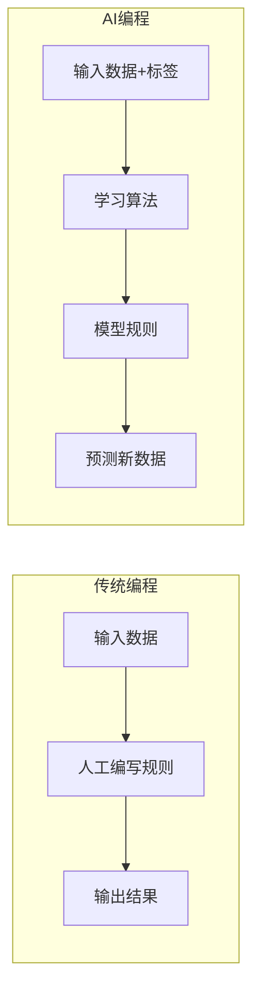

传统编程需要人工定义每一步操作，而AI编程通过训练数据让机器自动学习规则。这种从"规则驱动"到"数据驱动"的转变，是AI技术的本质特征。

### AI发展里程碑

人工智能的发展经历了多次浪潮，从早期的符号推理到今天的深度学习和大语言模型：

- **1956年**：达特茅斯会议，AI作为学科正式诞生
- **1997年**：IBM深蓝击败国际象棋世界冠军卡斯帕罗夫
- **2012年**：AlexNet在ImageNet竞赛中大幅提升图像识别准确率，深度学习时代开启
- **2016年**：AlphaGo击败围棋世界冠军李世石，证明AI在复杂策略游戏上的能力
- **2022年**：ChatGPT发布，大语言模型展现惊人的自然语言理解和生成能力，开启AI新纪元

### AI在我们身边

AI技术已经渗透到我们生活的方方面面：

- **语音助手**：Siri、小爱同学、天猫精灵等智能音箱
- **人脸识别**：手机解锁、刷脸支付、门禁系统
- **推荐系统**：抖音、小红书、淘宝的个性化推荐
- **自动驾驶**：特斯拉、萝卜快跑等自动驾驶技术
- **智能写作**：ChatGPT、文心一言等AI写作助手
- **搜索引擎**：百度、Google的智能搜索和问答

## 二、机器学习：让机器从数据中学习

机器学习（Machine Learning，ML）是AI的核心技术，其目标是通过算法让计算机从数据中自动学习规律，并利用这些规律对新数据进行预测或决策。

### 机器学习三大类型

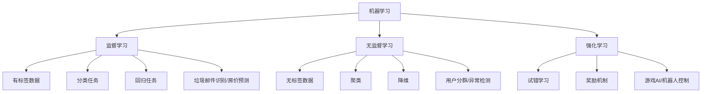

#### 1. 监督学习（Supervised Learning）

监督学习使用带有标签的训练数据，即每个输入样本都有对应的正确答案。模型通过学习输入与输出之间的映射关系，来预测新数据的输出。

**分类 vs 回归**

监督学习主要分为两类任务：

| 对比维度 | 回归问题 | 分类问题 |
|---------|---------|---------|
| 输出类型 | 连续数值 | 离散类别 |
| 示例 | 预测房价（150万、200万...） | 识别猫狗（猫、狗） |
| 输出示例 | 99.5、150.2 | 0、1、2 或 猫、狗、鸟 |
| 评估指标 | MSE、RMSE、MAE | 准确率、精确率、召回率 |

**常用监督学习算法**

- **线性回归**：用直线拟合数据，预测连续值。适用于房价预测、销量预测等场景。
- **逻辑回归**：二分类问题的经典算法，使用Sigmoid函数输出概率值。适用于垃圾邮件识别、信用评分等。
- **决策树**：像树一样不断分支判断，可解释性强。适用于规则提取、分类等场景。
- **随机森林**：多棵决策树并行训练，通过投票决定最终结果，抗过拟合能力强。在Kaggle竞赛中经常使用。
- **梯度提升（XGBoost、LightGBM、CatBoost）**：串行构建多个弱分类器，每个新分类器纠正前一个分类器的错误。在结构化数据上表现极佳，是竞赛和工业界首选。
- **支持向量机（SVM）**：找到最佳分割超平面，最大化类别间的间隔。适用于高维数据和文本分类。
- **朴素贝叶斯**：基于贝叶斯定理和特征条件独立假设的分类算法。快速高效，适用于垃圾邮件检测、文本分类。
- **K近邻（KNN）**：根据最近邻居的类别来预测新样本的类别。简单直观，适用于推荐系统、简单分类任务。

#### 2. 无监督学习（Unsupervised Learning）

无监督学习使用没有标签的数据，让算法自己发现数据中的内在结构和模式。

**常用无监督学习算法**

- **K均值聚类（K-Means）**：将数据自动分成K个簇，每个簇中心点代表该簇的特征。适用于用户分群、图像压缩等场景。
- **层次聚类**：自底向上合并相似样本，形成树状结构。不需要预设簇数量，适用于生物分类、文档组织。
- **PCA降维**：主成分分析，找到数据的主要方向，将高维数据投影到低维空间。适用于数据可视化和加速训练。
- **t-SNE、UMAP**：非线性降维技术，用于高维数据可视化。广泛应用于MNIST数据集可视化、单细胞数据分析等。
- **DBSCAN**：基于密度的聚类算法，能自动发现任意形状的簇并识别噪声点。适用于异常检测。
- **孤立森林**：通过随机分割特征空间来孤立异常点。适用于金融欺诈检测、网络入侵检测。
- **高斯混合模型（GMM）**：用多个高斯分布的混合来拟合数据，提供软聚类（概率输出）。适用于数据分布建模。

#### 3. 强化学习（Reinforcement Learning）

强化学习通过智能体（Agent）与环境的交互，通过试错和奖励机制来学习最优策略。

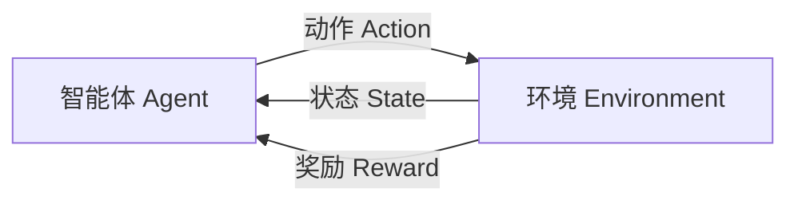

**强化学习核心要素**

- **智能体（Agent）**：执行动作的主体
- **环境（Environment）**：智能体所处的外部世界
- **状态（State）**：对环境的描述
- **动作（Action）**：智能体可以执行的操作
- **奖励（Reward）**：环境对智能体动作的反馈
- **策略（Policy）**：智能体根据状态选择动作的规则

强化学习在游戏AI（如AlphaGo）、机器人控制、自动驾驶等领域取得了显著成果。

### 机器学习工作流程

一个完整的机器学习项目通常包含以下步骤：

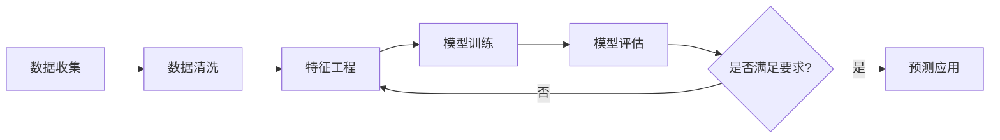

**1. 数据收集**：从各种数据源（数据库、API、文件、网页等）收集原始数据。

**2. 数据清洗**：处理缺失值、异常值、重复数据，保证数据质量。

**3. 特征工程**：从原始数据中提取有意义的特征，包括特征选择、特征变换、特征创建等。这是机器学习中最具创造性的环节，往往决定了模型的上限。

**4. 模型训练**：选择合适的算法，使用训练数据训练模型，调整超参数优化模型性能。

**5. 模型评估**：使用测试数据评估模型性能，计算准确率、精确率、召回率、F1分数等指标。

**6. 预测应用**：将训练好的模型部署到生产环境，对新数据进行预测。

### 机器学习核心概念

在开始深入学习之前，需要掌握以下几个核心概念：

- **数据（Data）**：AI学习的原材料，分为训练集、验证集、测试集
- **模型（Model）**：学习到的规律或函数表示
- **训练（Training）**：从数据中学习规律的过程
- **预测（Prediction）**：用模型对新数据进行推断
- **准确率（Accuracy）**：预测正确的比例
- **过拟合（Overfitting）**：模型在训练集上表现很好，但在测试集上表现很差
- **欠拟合（Underfitting）**：模型在训练集和测试集上表现都不好
- **偏差-方差权衡（Bias-Variance Tradeoff）**：模型复杂度的权衡问题

## 三、深度学习：基于神经网络的机器学习

深度学习是机器学习的一个子领域，使用多层神经网络（Deep Neural Networks）来学习数据的复杂表示。深度学习在图像识别、自然语言处理、语音识别等领域取得了突破性进展。

### 神经网络基础

#### 神经元结构

神经网络的基本单元是神经元，模仿生物神经元的工作原理：

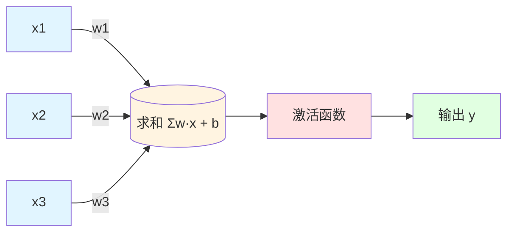

**单个神经元的工作原理**：

1. **加权求和**：输入与对应的权重相乘后相加，加上偏置项：`z = Σ(wᵢ · xᵢ) + b`
2. **激活函数**：通过非线性激活函数将求和结果转换为输出：`y = σ(z)`

**常用激活函数**：

- **Sigmoid**：将值压缩到(0,1)区间，适合二分类输出
- **Tanh**：将值压缩到(-1,1)区间，零中心化
- **ReLU（Rectified Linear Unit）**：`f(x) = max(0, x)`，解决梯度消失问题，最常用
- **Leaky ReLU**：ReLU的改进版本，避免负值死亡

#### 多层神经网络

多层神经网络由输入层、多个隐藏层和输出层组成：

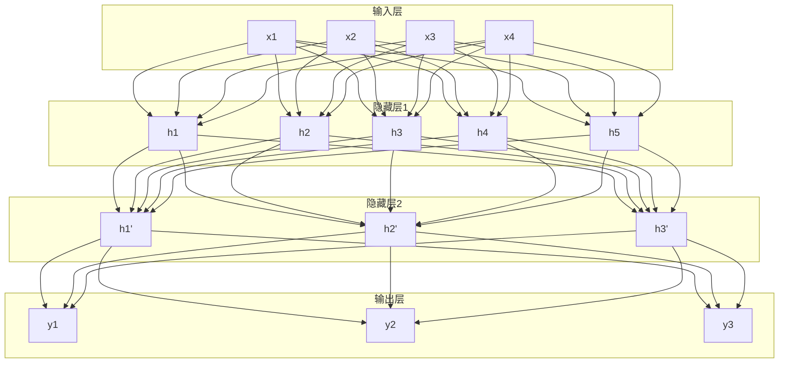

多层神经网络的核心优势在于：

- **特征自动学习**：不需要人工设计特征，网络自动从原始数据中学习层次化的特征表示
- **非线性表达能力**：通过激活函数和多层结构，可以学习复杂的非线性关系
- **端到端学习**：直接从输入到输出进行学习，不需要分阶段处理

#### 前向传播与反向传播

神经网络的训练过程包含两个核心步骤：

**前向传播**：数据从输入层到输出层的传递过程，计算网络的输出。

**反向传播**：根据输出误差，从输出层向输入层反向传递误差，使用梯度下降算法更新网络参数（权重和偏置）。

### 卷积神经网络（CNN）

卷积神经网络（Convolutional Neural Network，CNN）是处理图像数据的主流架构，通过卷积层、池化层和全连接层的组合，有效提取图像的局部特征和全局特征。

#### CNN处理图像流程

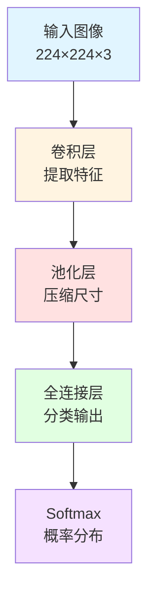

**CNN的核心组件**：

**1. 卷积层（Convolutional Layer）**

使用可学习的卷积核（滤波器）在输入图像上滑动，进行局部特征提取：

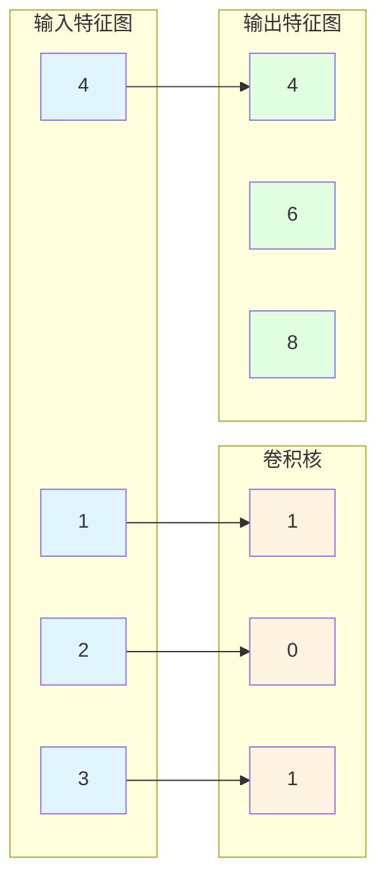

卷积操作的特点：

- **权值共享**：同一个卷积核在整个图像上共享权重，大幅减少参数数量
- **局部连接**：每个输出神经元只与输入的局部区域连接
- **平移不变性**：对图像中物体的位置变化具有鲁棒性

**2. 池化层（Pooling Layer）**

对特征图进行下采样，减少参数数量和计算量：

- **最大池化**：取局部区域的最大值
- **平均池化**：取局部区域的平均值

池化层的优点：减少计算量、防止过拟合、提供平移不变性。

**3. 全连接层（Fully Connected Layer）**

将前面提取的特征展平，连接到输出层进行分类或回归。

#### 经典CNN架构演进

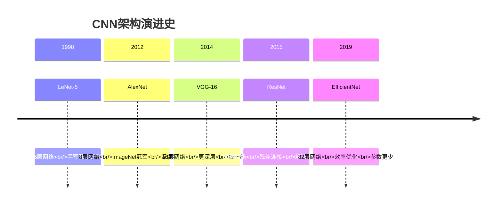

### 循环神经网络（RNN）

循环神经网络（Recurrent Neural Network，RNN）专门处理序列数据（如文本、语音、时间序列），通过循环连接使网络具有记忆能力。

#### RNN循环结构

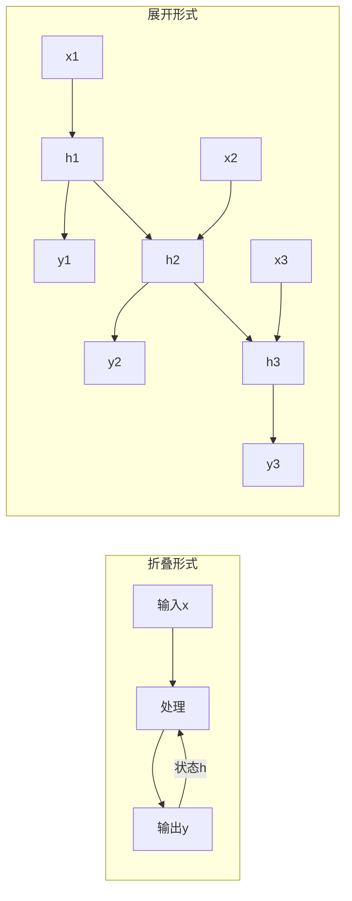

**RNN的核心思想**：每一时刻的输出不仅取决于当前输入，还取决于之前的所有记忆（隐藏状态）。

**RNN的计算公式**：

```
h_t = tanh(W_xh · x_t + W_hh · h_{t-1} + b_h)  # 隐藏状态
y_t = W_hy · h_t + b_y                          # 输出
```

#### LSTM（长短期记忆网络）

标准RNN存在长依赖问题：当序列很长时，梯度会逐渐消失或爆炸，导致无法学习长距离的依赖关系。

LSTM通过引入三个"门"机制来控制信息流动，有效解决了长依赖问题：

```mermaid
graph TB
    subgraph LSTM结构
        A[输入x_t<br/>上一步h_{t-1}] --> B[遗忘门<br/>f_t]
        A --> C[输入门<br/>i_t, C̃_t]
        A --> D[输出门<br/>o_t]
        
        B --> E[细胞状态C_t]
        C --> E
        D --> F[隐藏状态h_t]
        
        E --> D
        F --> G[输出y_t]
    end
```

**LSTM三个门的作用**：

1. **遗忘门（Forget Gate）**：决定从细胞状态中丢弃哪些信息
2. **输入门（Input Gate）**：决定向细胞状态中添加哪些新信息
3. **输出门（Output Gate）**：决定输出什么信息

**GRU（Gated Recurrent Unit）**：LSTM的简化版本，只有两个门（更新门和重置门），参数更少，训练更快。

#### RNN vs LSTM vs GRU

| 特性 | 普通RNN | LSTM | GRU |
|-----|---------|------|-----|
| 结构复杂度 | 简单 | 复杂（3个门） | 中等（2个门） |
| 参数数量 | 少 | 多 | 中等 |
| 长依赖处理 | 差 | 好 | 好 |
| 训练速度 | 快 | 慢 | 较快 |
| 应用场景 | 短序列 | 长序列、复杂任务 | 平衡性能和效率 |

**RNN/LSTM的应用场景**：

- 文本生成：基于上文生成下一个词
- 机器翻译：编码源语言，解码目标语言
- 语音识别：处理音频序列
- 时间预测：股票、天气等时序数据预测

### Transformer：自注意力网络

Transformer是2017年Google提出的革命性架构，完全基于注意力机制，抛弃了RNN的循环结构，实现了并行化处理，成为当前NLP领域的主流架构，也是GPT、BERT、Llama等大模型的基础。

#### Transformer整体架构

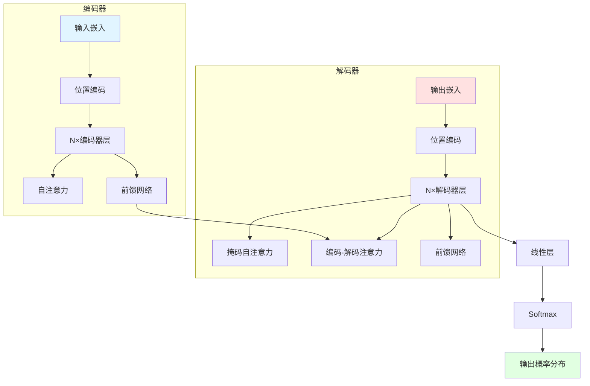

#### 自注意力机制（Self-Attention）

自注意力机制是Transformer的核心，允许序列中每个位置都能"关注"到其他所有位置。

**自注意力的计算过程**：

```
Attention(Q, K, V) = softmax(Q·K^T / √d_k) · V
```

其中：
- **Q（Query）**：查询向量，表示"我想查询什么"
- **K（Key）**：键向量，表示"我有什么特征"
- **V（Value）**：值向量，表示"我的实际内容"
- **d_k**：键向量的维度，用于缩放

**通俗理解**：

```mermaid
graph LR
    Q[Query: 我想找"苹果"] --> A[计算相似度]
    K1[Key: "苹果" 相似度0.9] --> A
    K2[Key: "香蕉" 相似度0.2] --> A
    K3[Key: "橘子" 相似度0.5] --> A
    
    A --> B[加权求和]
    V1[Value: 苹果的内容] --> B
    V2[Value: 香蕉的内容] --> B
    V3[Value: 橘子的内容] --> B
    
    B --> C[输出: 关注"苹果"的内容]
```

#### 多头注意力（Multi-Head Attention）

多头注意力将输入分成多个子空间，每个注意力头负责捕捉不同类型的关系：

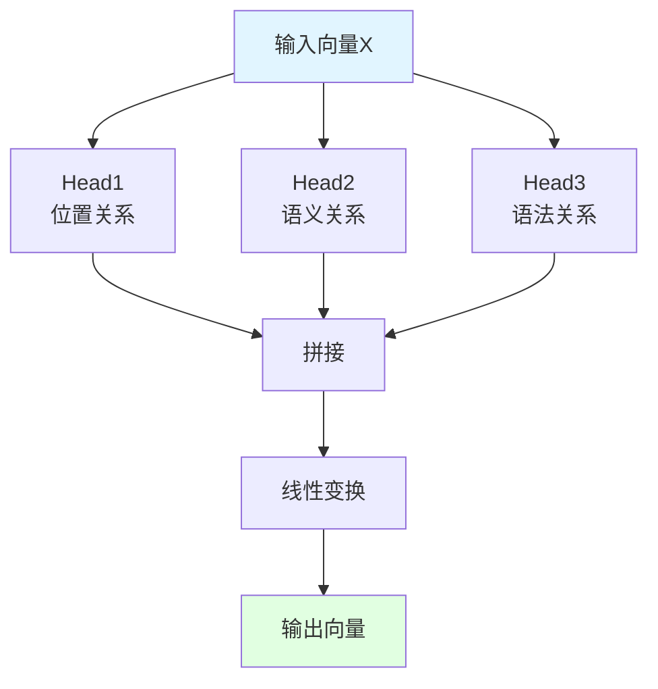

**多头注意力的优势**：

- 每个头可以学习不同的注意力模式
- 并行计算，提高效率
- 捕捉更丰富的关系特征

#### Transformer vs RNN

| 特性 | RNN | Transformer |
|-----|-----|-------------|
| 处理方式 | 顺序处理 | 并行处理 |
| 时间复杂度 | O(n) | O(1)（并行） |
| 长依赖问题 | 存在梯度消失 | 自注意力无长依赖问题 |
| 信息流动 | 单向 | 双向/全局 |
| 适用场景 | 短序列 | 各种长度序列 |
| 训练速度 | 慢 | 快 |
| 可扩展性 | 有限 | 可扩展到万亿参数 |

**为什么Transformer成为主流？**

1. 可以并行训练，训练速度快
2. 捕捉长距离依赖能力强
3. 可扩展性强（GPT可达万亿参数）
4. 预训练效果好

## 四、大语言模型：从GPT到AI智能体

大语言模型（Large Language Model，LLM）是基于Transformer架构的预训练语言模型，通过在海量文本数据上进行预训练，学习语言的统计规律和世界知识，展现出惊人的自然语言理解和生成能力。

### 大语言模型发展历程

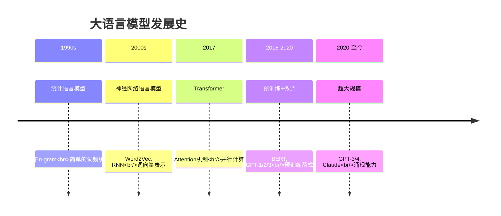

### 大语言模型的核心能力

1. **文本生成**：续写文章、创作内容、编写代码
2. **理解分析**：阅读理解、情感分析、文本摘要
3. **问答对话**：智能客服、知识问答、多轮对话
4. **代码编写**：代码生成、代码调试、代码解释
5. **翻译摘要**：多语言翻译、长文本摘要
6. **推理规划**：逻辑推理、任务规划、数学计算

### 模型规模对比

| 级别 | 参数量 | 能力特点 | 代表模型 |
|-----|-------|---------|---------|
| 小模型 | < 1B | 快速响应，简单任务 | GPT-2 Small |
| 中等模型 | 1-10B | 一般对话，简单推理 | LLaMA-7B |
| 大模型 | 10-100B | 复杂推理，多任务 | GPT-3, LLaMA-13B |
| 超大模型 | > 100B | 接近人类，多领域专家 | GPT-4, PaLM |

### 预训练与微调范式

大语言模型的训练分为两个阶段：

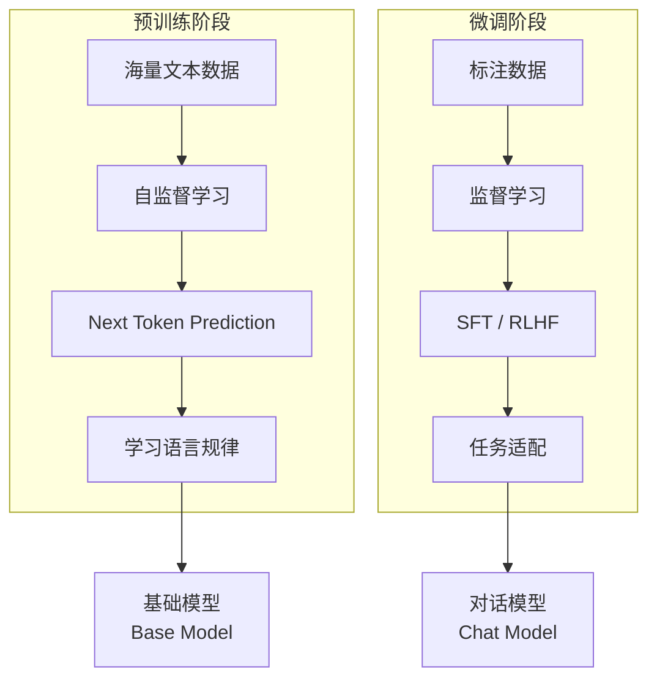

**预训练阶段**：

- **目标**：学习语言的统计规律和世界知识
- **数据**：海量文本数据（互联网文本、书籍、代码等）
- **方法**：自监督学习，主要是Next Token Prediction（预测下一个词）

**微调阶段**：

- **目标**：让模型适应特定任务，提高对话质量
- **数据**：高质量的对话数据、指令数据
- **方法**：
  - **SFT（Supervised Fine-tuning）**：有监督微调，使用标注的对话数据
  - **RLHF（Reinforcement Learning from Human Feedback）**：基于人类反馈的强化学习，让模型生成更符合人类偏好的输出

### 涌现能力（Emergent Abilities）

大语言模型最神奇的特性是：随着模型规模增大，会突然出现小模型不具备的能力，这种现象称为"涌现"。

**典型的涌现能力**：

1. **复杂推理**：多步逻辑推理、数学计算、因果推断
2. **思维链（Chain of Thought）**：分步骤解决问题，展示推理过程
3. **零样本迁移**：在未见过的任务上直接完成，无需示例
4. **上下文学习**：通过几个示例快速学会新任务
5. **代码生成**：从自然语言描述生成可执行代码
6. **多语言能力**：在多种语言间切换和理解

### 主流大语言模型对比

| 模型 | 公司 | 参数量 | 特点 | 开源 |
|-----|------|-------|------|------|
| GPT-4 | OpenAI | ~1.76T | 多模态、强大推理 | ❌ |
| Claude 3 | Anthropic | 未知 | 长上下文、安全对齐 | ❌ |
| LLaMA 3 | Meta | 70B | 开源领先、性能优秀 | ✅ |
| Qwen 2.5 | 阿里 | 72B | 中文优秀、开源 | ✅ |
| DeepSeek | 深度求索 | 67B | 推理能力强 | ✅ |

### 大语言模型分类

#### 按功能类型分类

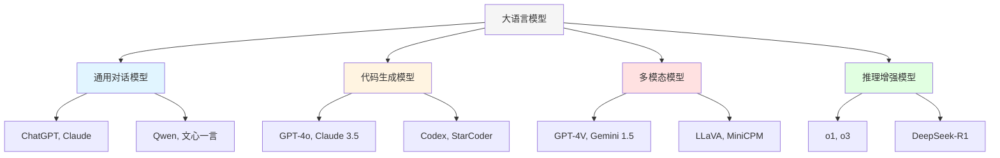

**1. 通用对话模型**

- **代表模型**：GPT-4, Claude 3, Qwen, 文心一言
- **特点**：知识广泛、表达自然、擅长日常对话
- **适用场景**：文本创作、知识问答、内容生成

**最佳实践**：

- 明确任务目标和期望输出格式
- 提供上下文信息帮助理解
- 使用Few-shot示例引导风格
- 复杂任务分步骤提问

**2. 代码生成模型**

- **代表模型**：GPT-4o, Claude 3.5, DeepSeek, Codex
- **特点**：代码准确、懂编程范式、能调试和解释代码
- **适用场景**：代码生成、代码调试、代码重构

**最佳实践**：

- 明确编程语言和框架版本
- 描述输入输出和数据结构
- 要求添加注释和单元测试
- 让模型解释代码逻辑

**3. 多模态模型**

- **代表模型**：GPT-4V, Gemini 1.5, Claude 3V, LLaVA
- **特点**：支持图像、视频、音频理解和生成
- **适用场景**：图像识别、图表分析、视觉问答

**最佳实践**：

- 图像清晰、关键信息突出
- 明确需要识别的内容
- 提供图像相关的文字说明
- 复杂图表分区域提问

**4. 推理增强模型**

- **代表模型**：o1, o3, DeepSeek-R1
- **特点**：深度思考、步骤清晰、擅长复杂推理
- **适用场景**：数学证明、逻辑推理、复杂问题求解

**最佳实践**：

- 给充足时间思考
- 提供完整的背景信息
- 要求展示推理过程
- 验证中间步骤正确性

#### 按部署方式分类

| 类型 | 代表模型 | 优势 | 适用场景 | 成本 |
|-----|---------|------|---------|------|
| 云端API | GPT-4, Claude API | 即用即付、无需运维 | 原型开发、小规模应用 | 按token计费 |
| 开源自部署 | LLaMA, Qwen, DeepSeek | 数据安全、可定制 | 企业内网、私有化部署 | GPU硬件成本 |
| 边缘部署 | Qwen-1.5-1.8B, Phi-3 | 低延迟、离线运行 | 移动端、嵌入式设备 | 设备成本 |

## 五、RAG系统：检索增强生成

RAG（Retrieval-Augmented Generation，检索增强生成）是一种将大语言模型与外部知识库结合的技术，通过检索相关文档片段，让LLM基于这些资料生成回答，解决了LLM知识更新滞后、产生幻觉等问题。

### RAG是什么？

RAG的核心思想是：先从你的知识库里"找资料"，再让LLM结合这些资料生成回答。

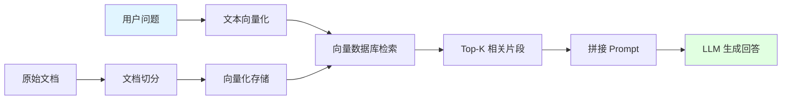

### RAG的价值

1. **解决知识滞后问题**：LLM的训练数据有时间截止日期，RAG可以让LLM访问最新的信息
2. **减少幻觉**：LLM有时会编造虚假信息，RAG基于真实文档回答，更可靠
3. **私有知识库**：企业可以将内部文档接入RAG，构建专属的知识问答系统
4. **可追溯性**：回答可以追溯到具体的文档来源，便于验证
5. **无需重新训练**：更新知识库即可，不需要重新训练模型

### RAG的核心三要素

#### 1. 文档切分（Chunking）

**为什么需要文档切分？**

- 文档太长，超出LLM的上下文窗口限制
- 检索时太粗粒度，会带进大量无关噪音
- 提高检索精度，只返回最相关的片段

**常见切分策略**：

- **固定长度切分**：按字符/Token数切，比如512/1024 token一块
- **按语义结构切**：按段落、章节、HTML结构、Markdown标题层级切
- **滑动窗口**：chunk之间有重叠，避免关键信息被切在边界外

**程序员要掌握**：

- 如何根据文档类型（PDF、Markdown、代码、日志）选择切分策略
- 切分时保留元数据（文件名、页码、章节、时间等），方便后续过滤和溯源

#### 2. Embedding（向量化表示）

**Embedding是什么？**

Embedding是把文本变成一个向量（高维数组），让计算机能衡量"语义相似度"。同义句在向量空间距离近，不同主题的句子距离远。

**典型做法**：

- 使用OpenAI text-embedding-3、bge、m3e等模型，把每个chunk映射成一个向量
- 问题本身也被同样模型Embedding，再去向量库里找最近邻

**程序员要掌握**：

- 不同Embedding模型的特点：多语言支持、长文本支持、维度大小
- 成本与性能权衡：Embedding模型质量和速度、向量维度与存储成本

#### 3. 向量数据库（Vector Database）

**向量数据库是什么？**

专门存"文本+向量"的数据库，支持高效的向量相似度检索。

**常见产品**：

- **云托管**：Pinecone、Weaviate、Qdrant Cloud
- **开源自托管**：Qdrant、Milvus、Chroma
- **数据库扩展**：pgvector（PostgreSQL扩展）

**核心能力**：

- **插入**：`chunk -> embedding -> (id, vector, metadata)`写入
- **查询**：给一个query vector，返回最相似的K个向量及其原始文本
- **过滤**：按时间、标签、权限等元数据过滤

**程序员要掌握**：

- 如何选型：云托管vs自托管、QPS、延迟、成本
- 如何设计集合/索引：命名空间、分区、元数据字段设计
- 检索参数：top_k、距离度量（cosine/dot product/l2）、阈值设定

### RAG的完整工作流

#### 数据准备阶段

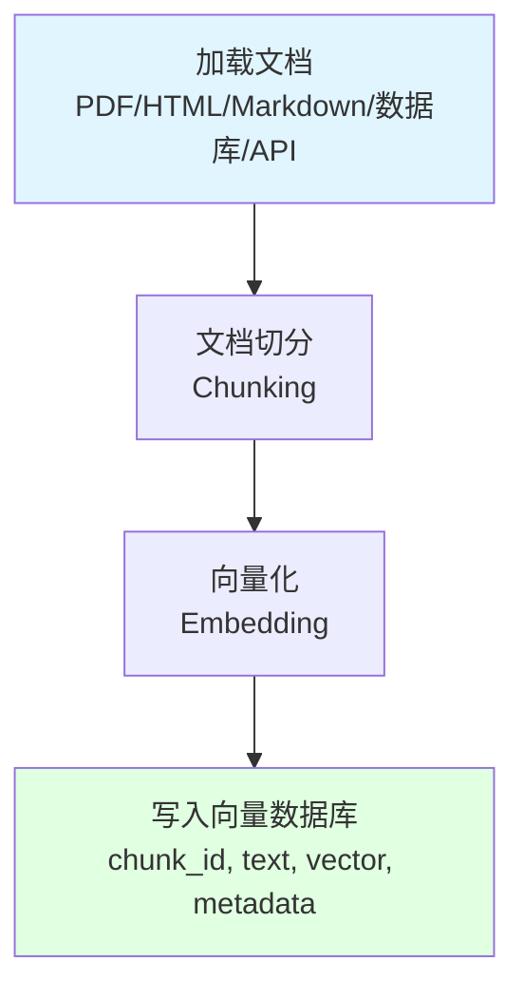

#### 在线服务阶段

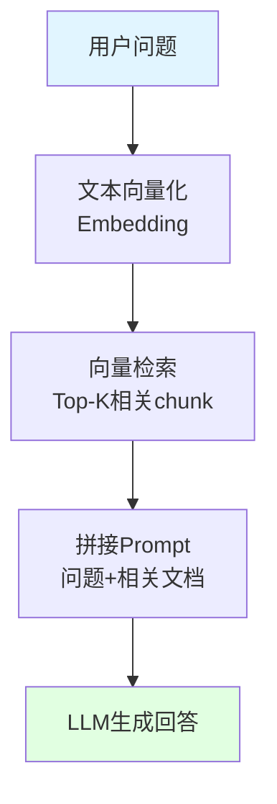

### RAG优化方向

1. **切分策略优化**：chunk大小、重叠、边界
2. **检索策略**：混合检索（关键词+向量）、重排（rerank）、过滤
3. **上下文压缩**：对检索回来的chunk做摘要或抽取，减少噪音
4. **多轮对话**：历史对话也作为上下文，参与检索

### RAG vs Fine-tuning

| 特性 | RAG | Fine-tuning |
|-----|-----|-------------|
| 目标 | 引入外部知识 | 适配特定任务/风格 |
| 数据需求 | 文档库 | 高质量标注数据 |
| 成本 | 较低 | 较高 |
| 知识更新 | 更新文档库即可 | 需要重新训练 |
| 幻觉问题 | 较少 | 仍可能存在 |
| 适用场景 | 知识问答、文档查询 | 任务适配、风格迁移 |

## 六、提示词工程：与AI高效沟通的艺术

提示词工程（Prompt Engineering）是通过设计、优化输入给大语言模型的提示词，来引导模型产生期望输出的技术和艺术。

### 用户级 Prompt Engineering

对于普通用户，提示词工程主要是学会如何与AI有效沟通：

**1. 明确任务**

```
❌ 帮我写个文案

✅ 请帮我为一家新开的咖啡店写一篇开业宣传文案，要求：
- 突出咖啡的纯正口感和舒适的环境
- 包含开业优惠活动信息
- 语气热情，吸引年轻人
- 字数在300字左右
```

**2. 提供上下文**

```
❌ 这段代码有什么问题？

✅ 我正在开发一个电商网站的用户登录功能，使用Python Flask框架。
以下是我的登录验证代码，在运行时出现了500错误：
[贴上代码]
请帮我分析问题所在，并提供修复建议。
```

**3. 给出示例（Few-shot）**

```
❌ 把这些句子翻译成英文

✅ 请把以下句子翻译成英文，保持原意：
中文：你好，世界！
英文：Hello, World!

中文：今天天气真好。
英文：The weather is great today.

中文：人工智能将改变未来。
英文：AI will change the future.

中文：我们要拥抱变化。
英文：
```

**4. 要求展示推理过程（Chain of Thought）**

```
❌ 解决这个数学题

✅ 请一步步解决以下数学题，并展示详细的推理过程：
一个水池有两个进水管A和B，一个出水管C。单开A，3小时注满；单开B，4小时注满；单开C，6小时放空。
如果三管同时打开，多少小时可以注满水池？
```

### 代码级 Prompt Engineering

对于程序员，提示词工程更加复杂和工程化，需要把Prompt当成代码的一部分来设计和管理。

#### 1. Prompt模板化

使用模板引擎（如Jinja2、Python f-string）定义Prompt模板：

```python
from langchain.prompts import PromptTemplate

template = """
你是一个企业知识库助手，请根据以下参考资料回答用户问题。

【参考资料】
{context_str}

【用户问题】
{question}

请用清晰、简洁的语言回答，并注明引用的文档编号。
"""

PROMPT = PromptTemplate(
    input_variables=["context_str", "question"],
    template=template,
)
```

#### 2. 动态拼接Prompt

在RAG场景中，典型流程是：

- 从向量库拿到chunks
- 将chunks拼成一个长字符串`context_str`
- 与用户问题一起填进模板
- 丢给LLM

**程序员要掌握**：

- 如何在代码里组织Prompt的结构：系统角色、安全指令、输出格式、示例等
- 如何避免Prompt注入：对用户输入做长度限制、过滤敏感词、转义

#### 3. Prompt的版本管理与实验

- 把Prompt模板放在配置文件/数据库里，而不是写死在代码中
- 记录每次对话使用的Prompt版本，方便效果回溯
- 使用A/B测试，比较不同Prompt的质量、长度、成本

### 提示词工程的核心要素

```mermaid
graph TB
    A[提示词工程] --> B[Role<br/>角色]
    A --> C[Instruction<br/>任务]
    A --> D[Context<br/>上下文]
    A --> E[Output Format<br/>输出格式]
    A --> F[Examples<br/>示例]
    
    style A fill:#f5f5f5
    style B fill:#e1f5ff
    style C fill:#fff4e1
    style D fill:#ffe1e1
    style E fill:#e1ffe1
    style F fill:#f5e1ff
```

**1. Role（角色）**

明确告诉模型扮演什么角色：

```
你是一位经验丰富的Python工程师，擅长代码优化和性能调优。
你是一位专业的医学顾问，提供健康建议时需要谨慎和准确。
你是一位富有创意的小说家，擅长写引人入胜的故事。
```

**2. Instruction（任务）**

清晰描述要完成的任务：

```
请分析以下代码的时间复杂度和空间复杂度。
请将以下长文本总结为3个要点。
请为以下产品写一段营销文案。
```

**3. Context（上下文）**

提供必要的背景信息：

```
背景：我们正在开发一个在线教育平台，用户主要是大学生。
目标：提高用户的学习参与度和完成率。
...
```

**4. Output Format（输出格式）**

指定期望的输出格式：

```
请以JSON格式输出：
{
  "summary": "摘要",
  "key_points": ["要点1", "要点2", "要点3"]
}

请以Markdown表格形式输出：
| 维度 | 评分 | 说明 |
|------|------|------|
| ... | ... | ... |
```

**5. Examples（示例）**

提供Few-shot示例，引导模型的输出风格：

```
示例1：
输入：今天天气不错
输出：positive

示例2：
输入：这部电影太烂了
输出：negative

示例3：
输入：这顿饭还行吧
输出：neutral

输入：AI技术真让人兴奋
输出：
```

### 控制输出结构

让LLM返回JSON、Markdown表格、代码等结构化结果，方便后端解析：

```python
prompt = """
请分析以下产品的优缺点，并以JSON格式输出：

产品名称：iPhone 15 Pro

输出格式：
{
  "advantages": ["优点1", "优点2", ...],
  "disadvantages": ["缺点1", "缺点2", ...],
  "summary": "总结"
}
"""
```

### 安全与合规

- **避免Prompt注入**：对用户输入做长度限制、过滤敏感词、转义
- **防止数据泄露**：不在Prompt中包含敏感信息
- **越权输出控制**：限制模型的输出范围

## 七、AI智能体：从工具到自主决策

AI智能体（Agent）是能够感知环境、分析推理、制定计划并执行行动的自主AI系统。与传统程序不同，智能体具有自适应学习、动态推理和自主规划能力。

### 什么是Agentic Engineering？

Agentic Engineering = 构建能够自主执行复杂任务的AI系统，核心问题是如何让AI Agent从玩具变成生产级系统。

**演进路径**：单Agent → 多Agent协作 → Agent生态系统

### AI智能体的核心原则

| 原则 | 说明 |
|------|------|
| 🎯 目标清晰 | Agent需要明确的任务目标和成功标准 |
| 🔧 可控性 | Agent行为可预测、可干预、可回滚 |
| 📊 可观测 | Agent决策过程透明，可追踪调试 |
| 🛡️ 安全性 | 防止Agent做出有害或意外行为 |

### AI智能体类型

```mermaid
graph TB
    A[AI智能体] --> B[简单反射智能体]
    A --> C[基于模型智能体]
    A --> D[目标导向智能体]
    A --> E[规划智能体]
    A --> F[学习智能体]
    A --> G[多智能体系统]
    
    B --> B1[条件→动作<br/>规则匹配]
    C --> C1[状态→模型→动作<br/>环境理解]
    D --> D1[目标→规划→执行<br/>搜索路径]
    E --> E1[分解→解决→整合<br/>分治策略]
    F --> F1[试错→强化→改进<br/>经验学习]
    G --> G1[分工→协作→共识<br/>多Agent协作]
    
    style A fill:#f5f5f5
    style B fill:#e1f5ff
    style C fill:#fff4e1
    style D fill:#ffe1e1
    style E fill:#e1ffe1
    style F fill:#f5e1ff
    style G fill:#f5f5f5
```

### AI智能体架构模式

#### 1. 单Agent架构

```mermaid
graph LR
    A[用户输入] --> B[Agent大脑]
    B --> C[工具调用]
    C --> D[结果输出]
    B -.记忆/反思.-> B
    
    style A fill:#e1f5ff
    style D fill:#e1ffe1
```

**特点**：简单直接，适合单一任务
**应用场景**：客服机器人、个人助手

#### 2. 多Agent协作架构

```mermaid
graph TB
    A[协调者Agent] --> B[执行者1]
    A --> C[执行者2]
    A --> D[专家Agent]
    
    B --> E[共享状态]
    C --> E
    D --> E
    
    style A fill:#fff4e1
    style E fill:#e1ffe1
```

**特点**：分工协作，适合复杂任务
**应用场景**：团队协作、复杂工作流

#### 3. 通信模式

**层级模式**

```mermaid
graph TB
    A[主管Agent] --> B[小组Agent]
    A --> C[小组Agent]
    B --> D[执行Agent]
    B --> E[执行Agent]
    C --> F[执行Agent]
    
    style A fill:#fff4e1
    style B fill:#e1f5ff
    style C fill:#e1f5ff
    style D fill:#e1ffe1
    style E fill:#e1ffe1
    style F fill:#e1ffe1
```

**特点**：任务逐层分解，自上而下执行
**适用场景**：大型项目

**协作模式**

```mermaid
graph LR
    A[Agent A] <--> B[Agent B]
    A <--> C[Agent C]
    B <--> C
    
    style A fill:#e1f5ff
    style B fill:#fff4e1
    style C fill:#ffe1e1
```

**特点**：平等沟通，共同决策
**适用场景**：peer review、协作决策

**发布订阅模式**

```mermaid
graph TB
    A[消息总线] --> B[Agent A]
    A --> C[Agent B]
    A --> D[Agent C]
    A --> E[Agent D]
    
    style A fill:#f5f5f5
    style B fill:#e1f5ff
    style C fill:#fff4e1
    style D fill:#ffe1e1
    style E fill:#e1ffe1
```

**特点**：松耦合，事件驱动，可扩展性强
**适用场景**：分布式系统、事件处理

### AI智能体核心组件

#### 1. 工具集（Tools）

智能体可调用的外部能力：

- **搜索**：SerpAPI, Wikipedia
- **计算**：Python REPL, Calculator
- **API**：HTTP请求
- **数据库**：SQL, MongoDB
- **文件**：读/写文件

#### 2. 记忆系统

存储对话历史和经验：

- **短期记忆**：当前对话上下文
- **长期记忆**：跨会话经验积累
- **工作记忆**：任务执行中间状态
- **知识检索**：RAG增强记忆

#### 3. 提示工程

引导智能体行为模式：

- **系统提示**：定义角色和约束
- **few-shot**：提供示例
- **CoT**：思维链推理

#### 4. 执行引擎

决策循环和执行逻辑：

- **ReAct**：推理+行动交替
- **Plan-Exec**：计划→执行
- **Tool Use**：工具调用

### ReAct智能体实现

ReAct（Reasoning + Acting）是一种经典的Agent模式，通过交替进行推理和行动来完成任务：

```mermaid
sequenceDiagram
    participant User
    participant Agent
    participant Tools
    
    User->>Agent: 用户问题
    loop Thought-Action-Observation循环
        Agent->>Agent: Thought: 思考下一步
        Agent->>Tools: Action: 调用工具
        Tools-->>Agent: Observation: 工具返回结果
    end
    Agent-->>User: 最终答案
```

**示例代码**：

```python
from typing import Dict, List, Optional, Tuple
from dataclasses import dataclass
from enum import Enum
import json

class ActionType(Enum):
    SEARCH = "search"
    CALCULATE = "calculate"
    READ_FILE = "read_file"
    LIST_FILES = "list_files"
    FINISH = "finish"

@dataclass
class Action:
    type: ActionType
    input: str

@dataclass
class Step:
    thought: str
    action: Optional[Action]
    observation: str

class ReActAgent:
    def __init__(self, llm, tools):
        self.llm = llm
        self.tools = {tool.name: tool for tool in tools}
        self.max_steps = 10
    
    def run(self, question: str) -> str:
        steps = []
        
        for _ in range(self.max_steps):
            # 生成思考和行动
            thought, action = self._think_and_act(question, steps)
            
            if action.type == ActionType.FINISH:
                return thought
            
            # 执行行动
            observation = self._execute_action(action)
            
            # 记录步骤
            steps.append(Step(thought, action, observation))
        
        return "未能完成任务"
    
    def _think_and_act(self, question: str, steps: List[Step]) -> Tuple[str, Action]:
        # 构建提示词
        prompt = f"""
问题：{question}

"""
        for step in steps:
            prompt += f"思考：{step.thought}\n"
            prompt += f"行动：{step.action.type.value} {step.action.input}\n"
            prompt += f"观察：{step.observation}\n\n"
        
        prompt += """
请继续思考并采取下一步行动。如果已经找到答案，请使用FINISH行动并给出答案。

思考：
行动："""
        
        # 调用LLM
        response = self.llm(prompt)
        
        # 解析响应
        thought, action = self._parse_response(response)
        return thought, action
    
    def _execute_action(self, action: Action) -> str:
        tool = self.tools.get(action.type.value)
        if tool:
            return tool.execute(action.input)
        return f"未知工具：{action.type.value}"
    
    def _parse_response(self, response: str) -> Tuple[str, Action]:
        # 解析LLM的响应，提取思考和行动
        # 这里简化处理，实际需要更复杂的解析逻辑
        lines = response.strip().split('\n')
        thought = lines[0]
        
        if len(lines) > 1:
            action_line = lines[1]
            if action_line.startswith("FINISH"):
                return thought, Action(ActionType.FINISH, "")
            else:
                parts = action_line.split(maxsplit=1)
                action_type = ActionType(parts[0])
                action_input = parts[1] if len(parts) > 1 else ""
                return thought, Action(action_type, action_input)
        
        return thought, Action(ActionType.FINISH, "")
```

### AI智能体与传统软件工程对比

| 维度 | 传统软件工程 | Agentic Engineering |
|------|--------------|---------------------|
| 控制流 | 确定性执行 | 非确定性，LLM驱动 |
| 调试方式 | 断点、日志 | 轨迹追踪、LLM重放 |
| 测试策略 | 单元测试、集成测试 | 场景测试、LLM评估 |
| 部署方式 | 代码发布 | Agent配置+提示词更新 |
| 可靠性保证 | 形式化验证 | 护栏+人工监督 |

### AI智能体评估指标

| 指标 | 说明 | 计算公式 |
|------|------|----------|
| 任务完成率 | 成功完成任务的比例 | 成功任务数 / 总任务数 |
| 步骤效率 | 完成任务的步数 | 平均步数或总步数 |
| 幻觉率 | 生成错误信息的比例 | 错误信息次数 / 总生成次数 |
| 工具调用准确率 | 正确使用工具的比例 | 正确使用次数 / 总工具调用次数 |
| 用户满意度 | 人工评估结果 | 调查问卷平均得分（1-5分） |

### AI智能体应用场景

- **智能客服**：多轮对话、问题解答
- **研究助手**：信息搜集、分析总结
- **代码助手**：代码编写、调试、测试
- **写作助手**：内容创作、编辑校对
- **工作流**：自动化流程编排
- **数据采集**：信息抓取、整理

## 八、LangChain：LLM应用开发框架

LangChain是一个强大的LLM应用开发框架，提供了构建LLM应用所需的工具和抽象，包括模型调用、提示词管理、链式调用、记忆系统、RAG集成、代理系统等。

### LangChain核心设计

```mermaid
graph TB
    A[LangChain] --> B[Models<br/>模型调用]
    A --> C[Prompts<br/>提示词]
    A --> D[Chains<br/>链式调用]
    A --> E[Agents<br/>代理系统]
    A --> F[Memory<br/>记忆系统]
    A --> G[RAG<br/>检索增强]
    A --> H[Callbacks<br/>回调系统]
    
    style A fill:#f5f5f5
    style B fill:#e1f5ff
    style C fill:#fff4e1
    style D fill:#ffe1e1
    style E fill:#e1ffe1
    style F fill:#f5e1ff
    style G fill:#e1f5ff
    style H fill:#fff4e1
```

### LangChain核心概念

#### 1. 模型调用（Models）

封装各种LLM接口，提供统一的调用方式：

```python
from langchain_openai import ChatOpenAI
from langchain_anthropic import ChatAnthropic

# OpenAI模型
llm = ChatOpenAI(model="gpt-4", temperature=0.7)

# Anthropic模型
llm = ChatAnthropic(model="claude-3-sonnet-20240229")

# 调用模型
response = llm.invoke("你好，请介绍一下你自己")
print(response.content)
```

#### 2. 提示词（Prompts）

提供多种提示词模板，方便管理和复用：

```python
from langchain.prompts import ChatPromptTemplate, MessagesPlaceholder

# 聊天格式模板
prompt = ChatPromptTemplate.from_messages([
    ("system", "你是一个专业的AI助手。"),
    MessagesPlaceholder(variable_name="history", n_messages=10),
    ("human", "{input}")
])

# 简单文本模板
from langchain.prompts import PromptTemplate
simple_prompt = PromptTemplate(
    input_variables=["question"],
    template="请回答以下问题：{question}"
)
```

#### 3. 链（Chains）

将多个组件串联起来，形成复杂的处理流程：

```python
from langchain.chains import LLMChain, SequentialChain

# 简单链
chain = LLMChain(llm=llm, prompt=prompt)

# 顺序链
chain1 = LLMChain(llm=llm, prompt=prompt1, output_key="summary")
chain2 = LLMChain(llm=llm, prompt=prompt2, input_keys=["summary"])

overall_chain = SequentialChain(
    chains=[chain1, chain2],
    input_variables=["input"],
    output_variables=["final_output"]
)
```

#### 4. 记忆（Memory）

持久化对话状态，支持多轮对话：

```python
from langchain.memory import ConversationBufferMemory, ConversationWindowMemory

# 缓冲记忆（保存所有对话历史）
memory = ConversationBufferMemory(
    return_messages=True,
    memory_key="history"
)

# 窗口记忆（只保留最近的N条消息）
memory = ConversationWindowMemory(
    k=5,  # 只保留最近5条消息
    return_messages=True
)
```

#### 5. RAG集成

构建检索增强生成系统：

```python
from langchain.document_loaders import TextLoader
from langchain.text_splitter import RecursiveCharacterTextSplitter
from langchain.embeddings import OpenAIEmbeddings
from langchain.vectorstores import Chroma
from langchain.chains import RetrievalQA

# 加载文档
loader = TextLoader("documents.txt")
documents = loader.load()

# 分割文档
text_splitter = RecursiveCharacterTextSplitter(chunk_size=1000, chunk_overlap=200)
splits = text_splitter.split_documents(documents)

# 向量化并存储
embeddings = OpenAIEmbeddings()
vectorstore = Chroma.from_documents(documents=splits, embedding=embeddings)

# 创建检索器
retriever = vectorstore.as_retriever(search_kwargs={"k": 4})

# 创建RAG链
qa_chain = RetrievalQA.from_chain_type(
    llm=llm,
    chain_type="stuff",
    retriever=retriever
)

# 查询
result = qa_chain.invoke("你的问题是什么？")
print(result['result'])
```

#### 6. 代理系统（Agents）

构建能够自主决策和调用工具的智能体：

```python
from langchain.agents import Tool, AgentExecutor, create_react_agent
from langchain.tools import DuckDuckGoSearchRun

# 定义工具
search = DuckDuckGoSearchRun()
tools = [
    Tool(
        name="Search",
        func=search.run,
        description="用于搜索网络信息"
    )
]

# 创建Agent
agent = create_react_agent(
    llm=llm,
    tools=tools,
    prompt=prompt
)

# 创建执行器
agent_executor = AgentExecutor(
    agent=agent,
    tools=tools,
    verbose=True
)

# 执行任务
result = agent_executor.invoke({"input": "搜索最新的AI新闻"})
```

### LangChain RAG工作流程

```mermaid
graph TB
    A[用户问题] --> B[检索器]
    B --> C[向量数据库]
    C --> D[返回相关文档]
    D --> E[提示词模板]
    E --> F[LLM生成]
    
    style A fill:#e1f5ff
    style F fill:#e1ffe1
```

### LangChain代理系统

```mermaid
graph TB
    A[接收任务] --> B[选择工具]
    B --> C[执行工具]
    C --> D[观察结果]
    D --> E[更新思考]
    E --> F{任务完成?}
    F -->|否| B
    F -->|是| G[返回结果]
    
    style A fill:#e1f5ff
    style G fill:#e1ffe1
```

### LangChain常用模式对比

| 模式 | 复杂度 | 适用场景 |
|-----|-------|---------|
| 简单LLM调用 | ⭐ | 单次问答、简单任务 |
| 链式调用 | ⭐⭐ | 多步骤处理、复杂流程 |
| 对话系统 | ⭐⭐ | 聊天机器人、客服系统 |
| RAG系统 | ⭐⭐⭐ | 知识库、文档问答 |
| 代理系统 | ⭐⭐⭐⭐ | 工具调用、多任务协调 |

### LangChain生产实践

| 场景 | 推荐方案 |
|-----|---------|
| 模型选择 | GPT-4(复杂), GPT-3.5(简单), Claude(长文本) |
| 缓存策略 | 语义缓存、Redis缓存 |
| 速率限制 | Token限流、请求限流 |
| 错误处理 | 重试机制、降级方案 |
| 监控告警 | LangSmith、日志系统 |

## 九、AI学习路径：从入门到精通

### 学习阶段概览

```mermaid
graph LR
    A[入门阶段<br/>2-3月] --> B[进阶阶段<br/>3-4月]
    B --> C[高级阶段<br/>3-4月]
    C --> D[实战阶段<br/>持续]
    
    style A fill:#e1f5ff
    style B fill:#fff4e1
    style C fill:#ffe1e1
    style D fill:#e1ffe1
```

### 入门阶段（2-3个月）

#### 第1阶段：Python编程基础（4周）

**学习内容**：

- 基础语法：变量、数据类型、运算符、流程控制
- 函数：定义、参数、返回值、作用域
- 面向对象：类、对象、继承、多态
- 文件操作：读写文件、异常处理
- 常用库：NumPy、Pandas、Matplotlib

**推荐资源**：

- 官方文档：Python.org
- 在线教程：廖雪峰Python教程
- 实践平台：LeetCode、牛客网

#### 第2阶段：机器学习入门（4周）

**学习内容**：

- 监督学习：线性回归、逻辑回归、决策树、随机森林
- 无监督学习：K-means聚类、PCA降维
- 模型评估：准确率、精确率、召回率、F1分数
- 特征工程：特征选择、特征变换、特征创建
- Scikit-learn：机器学习库的使用

**推荐资源**：

- 课程：吴恩达机器学习课程
- 书籍：《机器学习》- 周志华
- 实践：Kaggle入门竞赛

#### 第3阶段：数据处理与分析（2周）

**学习内容**：

- 数据清洗：处理缺失值、异常值、重复数据
- 数据可视化：Matplotlib、Seaborn
- 探索性数据分析：统计描述、相关性分析
- 实战小项目：完成一个完整的数据分析项目

### 进阶阶段（3-4个月）

#### 第4阶段：深度学习基础（4周）

**学习内容**：

- 神经网络原理：神经元、激活函数、损失函数
- 反向传播：梯度下降、优化器
- 常用框架：PyTorch、TensorFlow

**推荐资源**：

- 课程：李飞飞CS231n
- 书籍：《深度学习》- 花书
- 实践：PyTorch官方教程

#### 第5阶段：PyTorch/TensorFlow（4周）

**学习内容**：

- 框架基本使用：张量操作、自动求导
- 模型构建：定义层、构建网络
- 数据加载：Dataset、DataLoader
- 模型训练：训练循环、保存和加载模型

#### 第6阶段：计算机视觉（3周）

**学习内容**：

- CNN原理：卷积层、池化层、全连接层
- 图像分类：ResNet、EfficientNet
- 目标检测：YOLO、Faster R-CNN
- 迁移学习：使用预训练模型

#### 第7阶段：自然语言处理（3周）

**学习内容**：

- 文本预处理：分词、词向量、序列化
- RNN/LSTM/GRU：序列建模
- Transformer原理：自注意力机制
- BERT/GPT：预训练模型

### 高级阶段（3-4个月）

#### 第8阶段：大语言模型应用（4周）

**学习内容**：

- GPT、BERT原理
- 预训练和微调
- 提示工程（Prompt）
- LangChain应用开发

**推荐资源**：

- 论文：Attention is All You Need
- 框架：Hugging Face Transformers
- 实践：构建自己的聊天机器人

#### 第9阶段：RAG系统开发（3周）

**学习内容**：

- 向量数据库：Chroma、Qdrant、Pinecone
- 文档检索：Embedding、相似度搜索
- RAG架构设计
- 知识库构建

#### 第10阶段：AI智能体开发（3周）

**学习内容**：

- Agent设计模式
- 工具调用
- 多智能体协作
- ReAct范式

### 学习资源推荐

| 类型 | 推荐内容 | 适合阶段 |
|-----|---------|---------|
| 📺 在线课程 | Coursera: Machine Learning (Andrew Ng)<br>Fast.ai: Practical Deep Learning<br>B站: 李宏毅机器学习 | 入门/进阶 |
| 📖 书籍 | 入门:《机器学习》- 周志华<br>进阶:《深度学习》- 花书<br>实战:《动手学深度学习》 | 全部阶段 |
| 💻 实践平台 | Kaggle: 数据科学竞赛<br>Hugging Face: 模型和数据集<br>GitHub: 开源项目学习 | 进阶/实战 |
| 🔧 工具文档 | PyTorch: pytorch.org<br>TensorFlow: tensorflow.org<br>Scikit-learn: scikit-learn.org | 进阶 |

### 技能检查清单

#### 入门技能

- ✅ Python基础：能独立编写Python程序
- ✅ 数据分析：使用Pandas处理数据
- ✅ 机器学习：理解常用算法原理

#### 进阶技能

- ✅ 深度学习：理解神经网络原理
- ✅ 框架使用：能使用PyTorch建模
- ✅ 项目经验：完成过完整项目

#### 高级技能

- ✅ 大模型应用：能开发LLM应用
- ✅ 系统设计：能设计AI系统架构
- ✅ 部署上线：能进行模型部署

### 常见问题

**Q: 需要数学基础吗？**

入门阶段主要需要高中数学基础（概率、统计）。进阶时需要线性代数、概率论、微积分。建议边学边补。

**Q: 需要GPU吗？**

入门阶段用CPU即可。深度学习训练阶段建议使用GPU（如Google Colab免费提供）。

**Q: 学习周期是多长？**

全职学习约6-10个月，业余学习约1-2年。关键是持续学习和动手实践。

**Q: 如何检验学习效果？**

1. 能独立完成Kaggle入门竞赛
2. 能复现论文代码
3. 能开发完整AI应用

## 十、AI行业应用

AI技术已经渗透到各行各业，正在深刻改变我们的工作和生活方式。

### 医疗健康

- **影像诊断**：AI辅助X光、CT、MRI影像分析，辅助医生诊断疾病
- **药物发现**：AI加速新药研发过程，预测药物性质和相互作用
- **辅助手术**：机器人辅助精准手术，提高手术成功率
- **个性化治疗**：基于患者基因和病史，制定个性化治疗方案

### 金融科技

- **风险控制**：AI评估贷款风险、信用卡欺诈检测
- **反欺诈**：实时检测异常交易，保护账户安全
- **智能客服**：7×24小时智能客服，提高服务效率
- **信用评估**：基于大数据和AI，建立更准确的信用评分模型
- **量化交易**：AI算法自动交易，优化投资组合

### 零售电商

- **个性化推荐**：基于用户行为和偏好，推荐感兴趣的商品
- **需求预测**：预测销量，优化库存管理
- **智能定价**：动态定价，最大化收益
- **虚拟试衣**：AR技术，在线试穿衣物
- **无人零售**：自动识别商品，无人结账

### 制造业

- **质量检测**：AI视觉检测产品缺陷，提高质量
- **预测性维护**：预测设备故障，提前维护
- **机器人控制**：AI优化机器人路径和动作
- **工艺优化**：AI优化生产参数，提高效率
- **供应链优化**：预测需求，优化供应链

### 交通运输

- **自动驾驶**：特斯拉、萝卜快跑等自动驾驶技术
- **交通预测**：预测交通流量，优化信号灯
- **智能调度**：网约车、公交智能调度
- **路径规划**：最优路径推荐
- **车辆检测**：交通违法检测、车牌识别

### 教育培训

- **个性化学习**：根据学生水平，推荐个性化学习内容
- **智能答疑**：AI助教，24小时解答学生问题
- **自适应测评**：动态调整测评难度，准确评估能力
- **自动批改**：自动批改作业和作文
- **虚拟实验室**：VR/AR虚拟实验环境

### 内容创作

- **文案写作**：AI辅助撰写广告、文章、报告
- **图像生成**：AI生成艺术图像、设计素材
- **视频生成**：AI生成短视频、动画
- **音乐创作**：AI作曲、编曲
- **游戏开发**：AI生成游戏关卡、剧情

## 十一、AI伦理与安全

随着AI技术的快速发展，AI伦理和安全问题日益受到关注。

### 主要风险

**1. 对抗攻击（Adversarial Attacks）**

通过对输入数据进行微小的、人类难以察觉的修改，欺骗AI模型做出错误的预测。

示例：在熊猫图片上添加肉眼不可见的噪声，AI却识别为长臂猿。

**2. 隐私泄露（Privacy Leakage）**

AI模型可能通过训练数据学习到敏感信息，并通过输出泄露出去。

示例：医疗AI模型可能通过推理攻击泄露患者的健康状况。

**3. 模型偏见（Model Bias）**

AI模型可能学习并放大训练数据中的偏见，导致不公平的决策。

示例：招聘AI模型可能对某些性别或种族存在偏见。

**4. 深度伪造（Deepfake）**

使用AI生成虚假的图像、视频、音频，可能被用于欺诈、诽谤等恶意目的。

示例：伪造名人的视频、音频，传播虚假信息。

### 安全措施

**1. 红队测试（Red Teaming）**

组织专业团队模拟恶意攻击，测试AI系统的安全性。

**2. 差分隐私（Differential Privacy）**

在训练过程中添加噪声，保护个人隐私。

**3. RLHF（人类反馈对齐）**

通过人类反馈训练AI，使其输出更符合人类的价值观和期望。

**4. 可解释性研究**

提高AI模型的透明度和可解释性，让用户理解决策过程。

**5. 内容过滤**

在输入和输出端添加内容过滤器，阻止敏感和有害内容的生成和处理。

## 十二、总结与展望

人工智能正在以前所未有的速度发展，从机器学习到深度学习，从大语言模型到AI智能体，每一次技术突破都在拓展AI的能力边界。

### 当前技术趋势

1. **模型规模持续增大**：从百万参数到万亿参数，涌现出更强的能力
2. **多模态融合**：文本、图像、音频、视频的统一理解和生成
3. **Agent化**：从被动响应到主动决策和执行
4. **端侧部署**：大模型在移动设备上的轻量化和优化
5. **垂直化应用**：针对特定领域优化的专用模型

### 未来发展方向

1. **更强大的推理能力**：AI能够进行更复杂的逻辑推理和数学计算
2. **更好的可解释性**：让人类理解AI的决策过程
3. **更强的泛化能力**：AI能够快速适应新任务和新领域
4. **人机协作**：AI作为人类的助手，增强人类能力
5. **AI for Science**：AI加速科学发现，如药物研发、材料科学

### 给学习者的建议

1. **打好基础**：数学、编程、机器学习基础不可少
2. **动手实践**：理论学习后，立即动手实现
3. **关注前沿**：关注论文、博客、开源项目，保持学习
4. **参与社区**：加入技术社区，与他人交流学习
5. **持续学习**：AI技术发展迅速，需要终身学习

### 给企业的建议

1. **明确需求**：不要为了AI而AI，明确业务需求
2. **从小做起**：从简单场景开始，逐步扩大应用
3. **数据优先**：高质量的数据是AI应用成功的关键
4. **安全第一**：重视AI伦理和安全，建立治理机制
5. **人才培养**：培养AI人才，建立AI团队

人工智能时代已经到来，它既是挑战，也是机遇。无论是个人还是企业，只有主动拥抱变化，持续学习和创新，才能在这个时代中立于不败之地。

---

**关于本文**

本文系统梳理了人工智能技术的核心知识体系，包括机器学习、深度学习、大语言模型、RAG系统、AI智能体、LangChain框架等内容。希望本文能够为读者提供一个清晰的学习路径和全面的知识框架。

**推荐学习资源**

- 官方文档：PyTorch、TensorFlow、Scikit-learn
- 在线课程：Coursera、Fast.ai、李宏毅机器学习
- 开源社区：GitHub、Hugging Face、Kaggle
- 技术博客：Towards Data Science、Machine Learning Mastery

**联系方式**

如有问题或建议，欢迎交流讨论。

---

*本文档持续更新中，欢迎提出修改建议。*